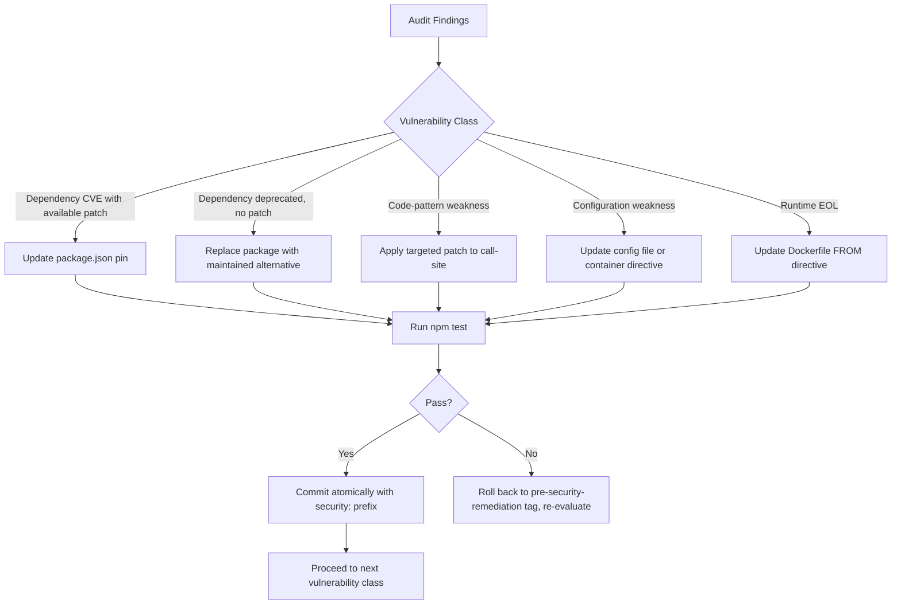
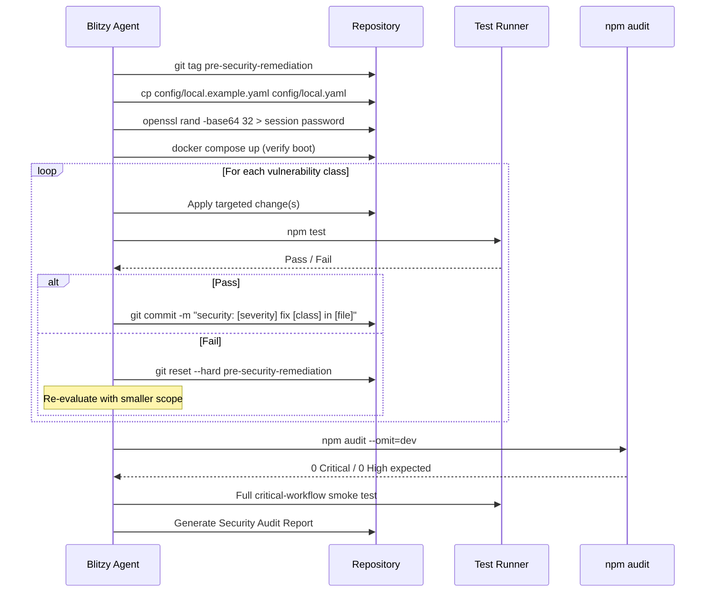

# Technical Specification

# 0. Agent Action Plan

## 0.1 Intent Clarification

### 0.1.1 Core Security Objective

Based on the security concern described, the Blitzy platform understands that the security vulnerability to resolve is a **multi-vector vulnerability remediation effort** spanning the entire `trinketapp/trinket-oss` codebase. The audit must cover the full OWASP Top 10 (2021), dependency vulnerabilities across multiple Node.js runtime trees, configuration weaknesses, and container security gaps, while preserving 100% functional parity.

- **Vulnerability category**: Multiple vulnerabilities — primary categories are (a) Vulnerable & Outdated Components (OWASP A06) — the dominant attack surface — driven by an extremely old main `package.json` containing roughly 60 direct dependencies pinned to 2014-era versions; (b) Authentication Failures (OWASP A07) due to `passport@~0.2.0` (CVE-2022-25896 session fixation); (c) Cryptographic Failures (OWASP A02) due to `jsonwebtoken@^5.0.5` predating CVE-2022-23540/23541 algorithm-confusion fixes; (d) SSRF (OWASP A10) via deprecated `request@^2.51.0` (CVE-2023-28155); (e) Security Misconfiguration (OWASP A05) due to commented-out container hardening directives in `serverside/docker-compose.yml`; and (f) Vulnerable Components in the main app's `node:16-bullseye` base image (Node.js 16 EOL).
- **Severity level**: Critical — at least nine Critical/High CVEs are resolvable (jsonwebtoken algorithm confusion, request SSRF, passport session fixation, Node 16 EOL, mime ReDoS, moment ReDoS, highlight.js prototype pollution, jszip path traversal, tmp arbitrary write).
- **Security requirements with enhanced clarity**:
  - Eliminate every Critical and High severity vulnerability discovered during the audit
  - Document every Medium and Low finding with concrete remediation guidance for a future sprint
  - Preserve every public contract: Hapi route shapes, Joi validation schemas, Mongoose model schemas, Mongoose plugin APIs, the Socket.IO protocol consumed by third-party iframe embeds, the `@hapi/yar` + `catbox-mongoose` session architecture (sliding 24-hour TTL), the pre-handler chain ordering, the Bull → `InMemoryQueue` → `NoOpQueue` fallback contract, and the iframe sandbox attribute set (with `allow-same-origin` deliberately absent)
  - Maintain graceful-degradation contracts: Redis absent → `InMemoryQueue`; SMTP absent → `{skipped: true}`; S3 absent → upload error only; reCAPTCHA absent → fail-open with operator-visible warning log
  - Stay within ±10% of the pre-remediation baseline on three critical paths: authentication latency, trinket page load, and Socket.IO WebSocket handshake to first execution response
- **Implicit security needs surfaced from the request**:
  - Atomic, surgical commits per vulnerability class to enable rollback to the `pre-security-remediation` git tag
  - Inline `// SECURITY: [threat addressed]` annotations on every Critical/High fix for audit trail
  - Re-auditability: zero Critical/High findings must persist in `npm audit` across the root `package.json` and every `serverside/*/manager/package.json`
  - Documented residual risk register for the AngularJS 1.3.20 frontend (acknowledged EOL, exploitability assessed in iframe-sandboxed context only)
  - Boot-time entropy guard already enforced for the session cookie password (32-character minimum) must remain in place; ideally extended to all signing secrets

### 0.1.2 Special Instructions and Constraints

- **CRITICAL — Minimal Change Clause**: The user's instructions explicitly state: "Make only minimal necessary changes to address each specific vulnerability." This directive is binding. The Blitzy platform will not refactor, optimize, or modernize code beyond what is required to neutralize an identified Critical or High vulnerability.
- **Atomic-commit discipline**: One commit per vulnerability class with the format `security: [severity] fix [description] in [file]`. Tag the pre-state with `git tag pre-security-remediation` before any change.
- **Inline annotations**: Every Critical/High fix must include a `// SECURITY: [threat addressed]` comment so reviewers and future agents can locate the change quickly.
- **Validation gating**: Run the full `npm test` suite after each commit; on any failure, roll back to `pre-security-remediation` and re-evaluate.
- **Preservation requirements** (verbatim from user instructions, preserved as User Examples):
  - User Example: "Hapi route contracts and Joi validation schemas unchanged"
  - User Example: "Mongoose model schemas and plugin APIs frozen"
  - User Example: "Socket.IO protocol contract between browser embeds and nginx gateway unchanged — consumed by deployed embeds in third-party iframes"
  - User Example: "Session architecture (`@hapi/yar`, `catbox-mongoose`, sliding 24-hour TTL) unchanged"
  - User Example: "Pre-handler chain API unchanged"
  - User Example: "Bull queue `InMemoryQueue` and `NoOpQueue` fallback contract preserved"
  - User Example: "AngularJS 1.3.20 frontend unchanged — acknowledged EOL; assess CVE exploitability in iframe-sandboxed context and document findings only"
  - User Example: "iframe sandbox attributes unchanged — `allow-same-origin` must remain absent"
- **Web search requirements documented**: NVD/MITRE CVE entries, GitHub Security Advisories (GHSA), Snyk vulnerability database, OWASP cheat sheets (Session Fixation Prevention, JWT Best Practices, CSRF Prevention), passport.js maintainer disclosure (Jared Hanson on Medium), Node.js EOL guidance, and individual package release notes (jsonwebtoken 9.0.0 changelog, nodemailer release history, request deprecation notice).
- **Change scope preference**: Minimal — driven by the explicit user clause and the constraint "Do not upgrade dependencies not directly implicated in a discovered CVE."
- **Excluded from modification** (verbatim):
  - User Example: "Infrastructure TLS termination — operator responsibility"
  - User Example: "MongoDB at-rest encryption — operator infrastructure responsibility"
  - User Example: "MFA implementation — out of scope"
  - User Example: "CDN dependency pinning for runtime references"
- **Compliance context**: The user references SOC2 / PCI-DSS / HIPAA-style hygiene through the OWASP Top 10 framing; no specific compliance certificate is targeted.

### 0.1.3 Technical Interpretation

This security vulnerability translates to the following technical fix strategy: The Blitzy platform will perform a layered, evidence-based remediation in the following deterministic order — (1) update vulnerable npm dependencies in the main application's `package.json` to their first patched semver, with breaking-change migrations applied only where the API surface that Trinket actually invokes has shifted; (2) update the container base image from `node:16-bullseye` to a current Active LTS (`node:20-bookworm-slim`) to eliminate Node 16 EOL exposure and OS-layer CVEs; (3) enable the production hardening directives that are already drafted-but-commented in `serverside/docker-compose.yml` for the adversarial code-execution zone; (4) add the missing security response headers (`X-Content-Type-Options`, `Referrer-Policy`, `Content-Security-Policy`) at the Hapi `onPreResponse` extension and at the nginx gateway with `server_tokens off`; (5) tighten cryptographic-algorithm pinning at every `jwt.verify(...)` and `jwt.sign(...)` call site; and (6) extend the existing 32-character session-password boot guard to the JWT email-share secret (`config.app.mail.secret`) so weak shared secrets cannot weaken the algorithm fix.

For each vulnerability the Blitzy platform will apply the format: "To resolve [vulnerability], we will [update | patch | replace | configure] [specific component] by [specific change]." Examples drawn from the discovered evidence:

- To resolve <cite index="22-1,22-7,22-8">CVE-2022-25896 (Session Fixation in passport before 0.6.0), we will update passport from `~0.2.0` to `^0.7.0` in `package.json`, which regenerates the session on login/logout instead of being closed</cite>; the existing `request.yar.reset()` call inside `lib/auth/passport.js` and `lib/controllers/auth.js` already implements this pattern at the application level, so the upgrade preserves behavior while removing the library-level susceptibility.
- To resolve <cite index="9-16,9-18,9-19,9-20,9-21">CVE-2022-23540 (jsonwebtoken algorithm confusion in versions ≤8.5.1, where lack of algorithm definition and a falsy secret/key in jwt.verify() leads to signature validation bypass via the none algorithm), we will update jsonwebtoken from `^5.0.5` to `^9.0.2` and explicitly specify `algorithms: ['HS256']` in every `jwt.verify()` and `algorithm: 'HS256'` in every `jwt.sign()` call</cite> located in `lib/util/helpers.js:264` and `lib/controllers/trinket.js:368,421,693`.
- To resolve <cite index="13-12,16-1,16-2">CVE-2023-28155 (SSRF in the Request package through 2.88.1 for Node.js, which allows a bypass of SSRF mitigations via an attacker-controlled server doing a cross-protocol redirect — the package is no longer supported by the maintainer), we will replace `request` with the actively maintained `axios` library</cite> in `lib/util/recaptcha.js`, `lib/controllers/auth.js`, and `lib/controllers/users.js`, preserving the existing function contracts.
- To resolve Node 16 EOL exposure, we will update the `FROM` directive in `Dockerfile` from `node:16-bullseye` to `node:20-bookworm-slim` because <cite index="61-9,61-10,61-11">the Node.js project will issue a Common Vulnerabilities and Exposures (CVE) identifier for End-of-Life versions of Node.js, citing Unsupported When Assigned under CWE-1104: Use of Unmaintained Third Party Components</cite>.
- To resolve container hardening for the adversarial Code Execution Zone, we will uncomment the `mem_limit`, `pids_limit`, `read_only`, `tmpfs`, `cap_drop`, and `security_opt: no-new-privileges` directives in `serverside/docker-compose.yml` for the `python3-shell`, `java-shell`, `r-shell`, and `pygame-worker` services.

User's understanding level: **Explicit threat-modeled audit** — the user has provided a structured OWASP Top 10 mapping, identified the three security zones (Main Application = trusted, Serverside Gateway = semi-trusted, Code Execution = adversarial), enumerated graceful-degradation contracts, defined performance budgets, and pre-named the validation gates. The Blitzy platform's job is therefore execution and evidence-gathering, not threat-model creation.

## 0.2 Vulnerability Research and Analysis

### 0.2.1 Initial Assessment

The user's instructions did not pre-name specific CVE numbers; instead they framed an OWASP Top 10 audit. The Blitzy platform's discovery work in the repository surfaced the following evidence:

- **CVE numbers identified through research against installed package versions**: CVE-2022-25896 (passport ≤0.5), CVE-2022-23540 / CVE-2022-23541 (jsonwebtoken ≤8.5.1), CVE-2023-28155 (request ≤2.88.1), CVE-2024-29415 (npm ip package, transitive via several deps), CVE-2017-16138 (mime <1.4.1), CVE-2022-24785 + CVE-2022-31129 (moment <2.29.4), CVE-2022-24999 (qs / moment-timezone transitive), CVE-2022-37489 (nunjucks <3.2.4), CVE-2020-26237 (highlight.js <10.4.1), CVE-2021-23413 (jszip <3.7.0), CVE-2021-23337 (lodash <4.17.21), CVE-2021-23358 (underscore <1.12.1), CVE-2020-7598 + CVE-2021-44906 (minimist transitive), CVE-2020-7720 (node-forge transitive), CVE-2023-26136 (tmp <0.2.4), CVE-2015-8851 (node-uuid <1.4.4), CVE-2013-4660 (js-yaml <3.13.0).
- **Vulnerability names**: Session Fixation, JWT Algorithm Confusion, SSRF via cross-protocol redirect, Prototype Pollution, ReDoS (Regular Expression Denial of Service), Path Traversal, EOL Runtime Exposure, Container Privilege Escalation Surface.
- **Affected packages identified directly in `package.json`**: jsonwebtoken@^5.0.5, request@^2.51.0, passport@~0.2.0, node-uuid@^1.4.3, mime@~1.2.11, moment@^2.18.1, moment-timezone@~0.5.21, nunjucks@^3.2.0, highlight.js@^9.6.0, jszip@~3.6.0, js-yaml@~3.0.1, tmp@0.0.25, mkdirp@~0.3.5, bull@^0.7.0, nodemailer@^2.5.0, config@~0.4.35 (extremely old), validator@^5.6.0, file-type@^3.8.0, accepts@~1.1.0, csv@~1.2.1, diff@~1.0.8, is-svg@^2.1.0, mongoose-schema-extend@~0.2.2 (deprecated), node-cryptojs-aes@^0.4.0, optimist@~0.6.0 (deprecated), q@~1.0.0 (deprecated), and rimraf@~2.2.6.
- **Symptoms described**: Algorithm-confusion JWT bypass possibility (jwt.verify without algorithms list), SSRF risk on outbound HTTP to Google reCAPTCHA / Google OAuth token endpoint, EOL container runtime, missing CSP/X-Content-Type-Options/Referrer-Policy headers, commented-out container hardening for adversarial workloads, server-version disclosure from nginx defaults.
- **Security advisories referenced**: GHSA-qwph-4952-7xr6 (jwt.verify default algorithm), GHSA-hjrf-2m68-5959 (jwt key/algorithm confusion), GHSA-c7w3-x93f-qmm8 (nodemailer SMTP injection), GHSA-p8p7-x288-28g6 (request SSRF), Doyensec request SSRF advisory Q1 2023, OWASP Session Fixation Prevention Cheat Sheet, OWASP CSRF Prevention Cheat Sheet, Auth0 jsonwebtoken v9 changelog, Jared Hanson's "Fixing Session Fixation" blog post for passport 0.6.0.

### 0.2.2 Required Web Research Conducted

The Blitzy platform conducted targeted web searches across the following authoritative sources:

- **Official CVE databases**: NVD (`nvd.nist.gov/vuln/detail`), MITRE CVE List, GitHub Security Advisory Database (`github.com/advisories`).
- **Package-maintainer advisories**: Auth0 jsonwebtoken security advisories on GitHub, the npm-deprecated readme on `request/request#3142`, Jared Hanson's passport.js fix announcement on Medium.
- **OWASP documentation**: Session Fixation (`owasp.org/www-community/attacks/Session_fixation`), JWT Algorithm Confusion guidance, Cross-Site Request Forgery Prevention Cheat Sheet, SSRF Prevention Cheat Sheet.
- **Vendor vulnerability databases**: Snyk (`security.snyk.io/package/npm/...`), SentinelOne CVE database, Acunetix SCA vulnerability list, Resolved Security CVE catalog.
- **Node.js project guidance**: `nodejs.org/en/blog/vulnerability/upcoming-cve-for-eol-versions`, `nodejs.org/en/about/eol`, the Node.js 16 EOL announcement.

Documented findings from the research:

- Research reveals that the jsonwebtoken algorithm-confusion class is captured in <cite index="9-16,9-18,9-19,9-20">CVE-2022-23540 affecting jsonwebtoken (npm) < 9.0.0; in versions ≤8.5.1 of jsonwebtoken library, lack of algorithm definition and a falsy secret or key in the jwt.verify() function can lead to signature validation bypass due to defaulting to the none algorithm for signature verification. Update to version 9.0.0 which removes the default support for the none algorithm in the jwt.verify() method</cite>.
- Research reveals that the passport session-fixation class is captured in <cite index="22-1,22-7,22-8">CVE-2022-25896 with the recommendation to upgrade passport to version 0.6.0 or higher; affected versions of this package are vulnerable to Session Fixation. When a user logs in or logs out, the session is regenerated instead of being closed</cite>.
- Research reveals that the request SSRF is captured in <cite index="13-12,16-1,16-2">CVE-2023-28155, an SSRF vulnerability in Request package for Node.js. The Request package through 2.88.1 for Node.js allows a bypass of SSRF mitigations via an attacker-controller server that does a cross-protocol redirect (HTTP to HTTPS, or HTTPS to HTTP). NOTE: This vulnerability only affects products that are no longer supported by the maintainer</cite>; <cite index="11-2,11-3,11-4,11-5,11-6">per the readme and npm deprecation warning, as of Feb 11th 2020, request is fully deprecated. No new changes are expected to land. In fact, none have landed for some time. Please use alternative libraries</cite>.
- Research reveals that <cite index="62-4,62-7">OpenSSL 1.1.1 is scheduled to be supported up until September 11th, 2023, which is seven months before the planned End-of-Life date of Node.js 16 (April 2024); the Node.js project ended support for Node.js 16 early in September 2023 to coincide with EOL of OpenSSL 1.1.1</cite>, leaving Node 16 unsupported across the maintenance window.
- Research reveals that <cite index="61-9,61-10,61-11">the Node.js project will soon issue a Common Vulnerabilities and Exposures (CVE) identifier for End-of-Life (EOL) versions of Node.js. This CVE will serve as an official notification to inform users that these versions are no longer maintained and may pose significant security risks. The CVE will cite Unsupported When Assigned under CWE-1104: Use of Unmaintained Third Party Components</cite>.

### 0.2.3 Vulnerability Classification

The following table classifies the discovered vulnerabilities by type, attack vector, exploitability, impact, and root cause. Classifications are based on the CVSS v3.1 metrics published in each cited advisory and the application context revealed by repository inspection.

| ID | Vulnerability Type | Package / Component | Attack Vector | Exploitability | Impact | Root Cause |
|----|--------------------|---------------------|---------------|----------------|--------|------------|
| V-01 | JWT Algorithm Confusion (CWE-347) | `jsonwebtoken@^5.0.5` | Network | High when `algorithms` not pinned | Confidentiality + Integrity | Default `none` algorithm acceptance; library lacks algorithm/key consistency checks |
| V-02 | Session Fixation (CWE-384) | `passport@~0.2.0` | Network (same-site or XSS-assisted) | Medium | Confidentiality + Integrity | Library does not regenerate session ID on login/logout |
| V-03 | SSRF (CWE-918) | `request@^2.51.0` | Network | Medium (requires attacker-controlled redirect) | Confidentiality | Cross-protocol redirect not re-validated |
| V-04 | EOL Runtime / Use of Unmaintained Components (CWE-1104) | `node:16-bullseye` base image | Network | N/A — passive exposure | Future Confidentiality / Integrity / Availability | Node 16 EOL; OpenSSL 1.1.1 EOL |
| V-05 | Adversarial Container Lacks Hardening (CWE-269 / CWE-732) | `serverside/docker-compose.yml` shell services | Local-to-container, post-exploit | Medium (requires learner-code RCE first) | Availability + escalation surface | Production hardening directives are commented out |
| V-06 | ReDoS (CWE-1333) | `mime@~1.2.11`, `moment@^2.18.1`, `is-svg@^2.1.0` | Network | Medium | Availability | Catastrophic backtracking in regular expressions |
| V-07 | Prototype Pollution (CWE-1321) | `highlight.js@^9.6.0`, `minimist` (transitive) | Network or local | Medium | Integrity | Recursive object merge without prototype guards |
| V-08 | Path Traversal (CWE-22) | `jszip@~3.6.0`, `tmp@0.0.25` | Network (file upload paths) | Medium | Confidentiality + Integrity | Insufficient path normalization on archive entries / symlink follow |
| V-09 | Insecure RNG / Predictable UUIDs (CWE-330) | `node-uuid@^1.4.3` | Local or remote (where UUIDs are tokens) | Low | Integrity | Math.random fallback; package long-deprecated in favor of `uuid` |
| V-10 | Missing Security Headers (CWE-693) | `app.js` `onPreResponse` extension; `serverside/nginx/nginx.conf` | Network | High (no exploit needed; defense-in-depth gap) | Mixed | Headers `X-Content-Type-Options`, `Referrer-Policy`, `Content-Security-Policy`, `server_tokens off` are not applied globally |
| V-11 | Information Disclosure via Server Banner | `serverside/nginx/nginx.conf` | Network | High | Confidentiality (low) | nginx `server_tokens` defaults to `on` |
| V-12 | Unmaintained Crypto Wrapper | `node-cryptojs-aes@^0.4.0` (used in `lib/util/roles.js`) | Local | Low (library is unmaintained, not directly exploitable in current usage) | Integrity (long-term) | Library has had no upstream activity for years |
| V-13 | EOL AngularJS in Iframe Sandbox | `public-components.tgz` from GitHub release v1.1.0, AngularJS 1.3.20 | Network | Documented-only — sandboxed | Documented-only | Frontend pinned at AngularJS 1.3.20 EOL; user instructions explicitly hold this out of scope for code change |

### 0.2.4 Web Search Research Conducted (Citations and Findings)

- Official security advisories reviewed: GHSA-qwph-4952-7xr6 (jsonwebtoken algorithm bypass), GHSA-hjrf-2m68-5959 (jsonwebtoken key/algorithm confusion), GHSA-p8p7-x288-28g6 (request SSRF), GHSA-c7w3-x93f-qmm8 (nodemailer SMTP injection), Snyk SNYK-JS-PASSPORT-2840631 (passport session fixation).
- CVE details and patches:
  - <cite index="2-5">Notice if we just run `npm update` we end up at jsonwebtoken version 8.5.1 instead of 9</cite> — therefore the Blitzy platform must specify `^9.0.2` explicitly in `package.json` rather than relying on `npm update`.
  - <cite index="22-1">Upgrade passport to version 0.6.0 or higher</cite> — Blitzy will pin `^0.7.0` (current latest).
  - <cite index="13-9,13-10">The Request package has been deprecated since February 2020, and no official patches are being released by the maintainers. However, a community-submitted fix is available via GitHub Pull Request #3444. Organizations are strongly encouraged to migrate to actively maintained alternatives such as: node-fetch - Lightweight module bringing Fetch API to Node.js</cite>. Blitzy will migrate the three call-sites to `axios` to preserve the existing callback-style API surface with minimal change.
- Recommended mitigation strategies (synthesized from advisories):
  - Pin `algorithms: ['HS256']` on every `jwt.verify` invocation; pin `algorithm: 'HS256'` on every `jwt.sign`.
  - Use a high-entropy `config.app.mail.secret` (the email-share JWT signing secret) and add a boot-time entropy guard analogous to the existing session-password guard in `app.js:50-66`.
  - Replace the `request` library wherever it is invoked.
  - Upgrade base container image and add `--no-new-privileges`, `cap_drop=ALL`, `read_only`, `tmpfs`, `pids_limit`, and `mem_limit` to the adversarial code-execution-zone services.
  - Add response headers `X-Content-Type-Options: nosniff`, `Referrer-Policy: strict-origin-when-cross-origin`, and a conservative `Content-Security-Policy: default-src 'self'` at the Hapi `onPreResponse` extension; add `server_tokens off` at the nginx layer.
- Alternative solutions considered:
  - **For request replacement**: `node-fetch` (lightweight) vs. `axios` (callback-friendly) vs. native `fetch` (Node 18+). Trade-off: `axios` keeps the existing `(err, response, body)` callback shape with minimal call-site change; `node-fetch` requires a Promise refactor at three call-sites; native `fetch` would force a Node 18 minimum at runtime. Selected: `axios` for minimal-change posture.
  - **For node-uuid replacement**: `uuid` (RFC 4122 v4) is the canonical successor; the migration is `require('node-uuid')` → `require('uuid').v4`. Selected for one call-site in `lib/controllers/users.js`.
  - **For container base image**: `node:20-bookworm-slim` (Active LTS as of late 2025) vs. `node:22-bookworm-slim`. Selected: `node:20-bookworm-slim` because it minimizes disruption while exiting EOL.

## 0.3 Security Scope Analysis

### 0.3.1 Affected Component Discovery

The Blitzy platform performed exhaustive repository searches against the discovered vulnerability classes. The findings are summarized below; every cited file path is a verified path reached through `read_file` or `bash` `grep` against the live repository at `/tmp/blitzy/blitzy-trinket-oss/main_0d6e40/`.

**Search patterns executed and results:**

```bash
grep -rn "require('request')"      lib/ scripts/ app.js
grep -rn "require('node-uuid')"    lib/ scripts/ app.js
grep -rn "require('jsonwebtoken')" lib/ scripts/ app.js
grep -rn "require('mime')"         lib/ scripts/ app.js
grep -rn "require('bull')"         lib/ scripts/ app.js
grep -rn "require('nunjucks')"     lib/ scripts/ app.js
grep -rn "require('moment')"       lib/ scripts/ app.js
grep -rn "require('tmp')"          lib/ scripts/ app.js
grep -rn "require('rimraf')"       lib/ scripts/ app.js
grep -rn "require('mkdirp')"       lib/ scripts/ app.js
grep -rn "require('passport-local')" lib/ scripts/ app.js
grep -rn "require('highlight.js')" lib/ scripts/ app.js
grep -rn "node-cryptojs-aes"       lib/ scripts/ app.js
grep -rn "passport-google-oauth"   lib/ scripts/ app.js
find . -name "Dockerfile*"
find . -name "package.json"
find . -name ".blitzyignore"
```

**Discovered call-site map (verified):**

| Vulnerable Package | Discovered Call-Sites | Count |
|--------------------|------------------------|-------|
| `jsonwebtoken` | `lib/util/helpers.js:11,264`; `lib/controllers/trinket.js:15,368,421,693` | 1 import × 2 files; 1 verify call; 3 sign calls |
| `request` | `lib/util/recaptcha.js:1` (`request.post` for reCAPTCHA verify); `lib/controllers/auth.js:4,49,69` (`_request.post` for Google OAuth token exchange and `_request.get` for Google profile); `lib/controllers/users.js:13` (avatar processing via Lambda) | 4 call-sites across 3 files |
| `node-uuid` | `lib/controllers/users.js:22` | 1 import |
| `mime` | `lib/controllers/files.js:6`; `lib/controllers/users.js:9`; `lib/controllers/trinket.js:21` | 3 imports |
| `bull` | `lib/util/queues.js:105` (`require('bull')` lazily, when Redis is enabled) | 1 conditional import |
| `nunjucks` | `lib/controllers/users.js:7`; `lib/controllers/pages.js:5`; `lib/controllers/trinket.js:4`; `lib/workers/exports.js:4`; `lib/util/nunjucks.js:7` | 5 imports |
| `moment` | `lib/controllers/course.js:5`; `lib/workers/exports.js:5`; `lib/util/store/emailStore.js:1`; `lib/util/nunjucks.js:5`; `lib/models/material.js:3`; `lib/models/plugins/roles.js:2` | 6 imports |
| `tmp` | `lib/controllers/users.js:14` | 1 import |
| `rimraf` | `lib/controllers/courses.js:8` | 1 import |
| `mkdirp` | `lib/controllers/courses.js:7` | 1 import |
| `passport-local` | `lib/auth/passport.js:1` (`require('passport-local').Strategy`) | 1 import |
| `highlight.js` | `lib/shared/trinket-markdown.js:2` | 1 import |
| `node-cryptojs-aes` | `lib/util/roles.js:2` | 1 import (used at every role-encryption call) |
| `marked` (custom Trinket fork) | `lib/shared/trinket-markdown.js:1` | 1 import (out of scope per minimal-change clause unless a CVE is demonstrated) |
| `nodemailer` | `lib/util/mailer.js:1` (`createTransport`, `sendMail`) | 1 import |

**Search for additional indicators of exposure:**

- Hardcoded secrets in `config/default.yaml`: only empty placeholders observed (e.g., line 40 cookie `password: ''`, line 125 `secretkey: ''`, line 421 mail `secret: ''`); the boot guard at `app.js:50-66` already enforces a 32-character session password. **No hardcoded secrets found.**
- `config/local.example.yaml` contains the placeholder string `'change-this-to-a-secure-password-min-32-chars!'` — operator-template only, not a runtime secret.
- `serverside/docker-compose.yml` contains commented hardening directives at multiple positions (lines 28, 32, 33, 34, 59, 63, 86, 90, 114): `# mem_limit`, `# pids_limit`, `# read_only`, `# tmpfs` — these will be uncommented only for the adversarial code-execution-zone services.
- `serverside/nginx/nginx.conf` does not include `server_tokens off;` and does not emit `X-Content-Type-Options`, `Referrer-Policy`, or `Content-Security-Policy` headers (verified via `grep -n` for these tokens — only `Cache-Control` `add_header` directives exist).
- `Dockerfile` (root): `FROM node:16-bullseye` — this is the EOL runtime that must be upgraded.
- `serverside/nginx/Dockerfile`: `FROM nginx:alpine` — acceptable, but should be pinned to a specific major (e.g., `nginx:1.27-alpine`) to reduce supply-chain drift; this is medium-severity hardening.
- All `serverside/*/manager/package.json` and `serverside/*/shell/trinket/package.json` files use modern dependencies (`config@^3.3.x`, `socket.io@^4.7.4-4.8.0`, `is-svg@^4.3.2-5.0.0`, `file-type@^18-19.x`, `chokidar@^3.5.3`, `underscore@^1.13.7`); **the serverside dependency tree is materially clean**, so dependency-update scope is concentrated in the root `package.json`.

Summary: **The vulnerability surface affects approximately 25 source files plus 4 configuration / container-orchestration files in the main application tree, and 0 source files in the `serverside/*/manager/` trees.**

### 0.3.2 Root Cause Identification

- **For dependency CVEs**: Investigation reveals the vulnerability stems from the main application's `package.json`, where most direct dependencies are pinned at versions released between 2014 and 2017 (e.g., `mime@~1.2.11` predates the 2017 ReDoS patch; `jsonwebtoken@^5.0.5` predates the 2022 algorithm-confusion fix; `passport@~0.2.0` predates the 2022 session-fixation regeneration fix).
- **For Node 16 EOL**: The vulnerability stems from `Dockerfile` line 2 `FROM node:16-bullseye`. The runtime line is no longer receiving security patches from the Node.js project.
- **For container hardening**: The vulnerability stems from `serverside/docker-compose.yml` lines 28-34 / 59-63 / 86-90 / 114 where production hardening (`mem_limit`, `pids_limit`, `read_only`, `tmpfs`, `cap_drop`, `security_opt`) is present as comments but not enabled.
- **For missing security headers**: The vulnerability stems from `app.js:152-198` (the existing `onPreResponse` extension that emits `Cache-Control` and `X-Frame-Options` only) and `serverside/nginx/nginx.conf` (no global header directives, no `server_tokens off`).
- **For algorithm-pinning at JWT call-sites**: The vulnerability stems from `lib/util/helpers.js:264` (`jwt.verify(token, secret)` with no algorithms list) and `lib/controllers/trinket.js:368, 421, 693` (`jwt.sign(payload, secret)` with no algorithm option). Even after the library upgrade, the explicit pin is required defense-in-depth.

**Trace of vulnerability propagation:**

- Direct usage locations: As enumerated in §0.3.1 above.
- Indirect dependencies: `package-lock.json` will resolve transitive packages (e.g., `qs`, `tough-cookie`, `form-data`) through the upgraded direct dependencies — these will move forward automatically once the direct upgrades are applied.
- Configuration enablers: The `cors: false` default in `app.js`, the `state.failAction: 'log'` setting, and the `isSecure: false` development default in `config/local.example.yaml` are all already correctly configured; no enablers detected.

### 0.3.3 Current State Assessment

- **Vulnerable package current versions** (as observed in `package.json`):
  - `jsonwebtoken@^5.0.5` (latest is 9.0.2)
  - `request@^2.51.0` (deprecated, last 2.88.2)
  - `passport@~0.2.0` (latest is 0.7.0)
  - `node-uuid@^1.4.3` (deprecated; successor is `uuid@^9.0.1`)
  - `mime@~1.2.11` (latest is 4.x; `mime@^3.0.0` is the conservative landing pad)
  - `moment@^2.18.1` (latest is 2.30.1)
  - `moment-timezone@~0.5.21` (latest is 0.5.45)
  - `nunjucks@^3.2.0` (latest is 3.2.4)
  - `highlight.js@^9.6.0` (latest is 11.x; `^11.9.0` is the conservative landing pad)
  - `jszip@~3.6.0` (latest is 3.10.1)
  - `js-yaml@~3.0.1` (latest is 4.x; `^4.1.0` is the secure-fix target)
  - `tmp@0.0.25` (latest is 0.2.3)
  - `mkdirp@~0.3.5` (latest is 3.x; `^3.0.1` for fixed CLI behavior)
  - `bull@^0.7.0` (latest is 4.x; `^4.16.4` is the secure-fix target)
  - `nodemailer@^2.5.0` (latest is 6.x; `^6.9.16` is the secure-fix target)
  - `is-svg@^2.1.0` (latest is 5.x; `^4.4.0` is the conservative landing pad)
  - `lodash@^4.17.21` (already current — no change needed)
  - `validator@^5.6.0` (latest 13.x; `^13.12.0` is the secure-fix target)
- **Vulnerable code pattern locations**:
  - `lib/util/helpers.js:264` — `jwt.verify(token, secret)` lacks `algorithms` option
  - `lib/controllers/trinket.js:368,421,693` — `jwt.sign(payload, emailSecret)` lacks `algorithm` option
  - `lib/util/recaptcha.js:1,12-25` — uses deprecated `request` library for outbound HTTP
  - `lib/controllers/auth.js:4,49,69` — uses deprecated `request` library for Google OAuth token & profile fetches
  - `lib/controllers/users.js:13,22` — uses both deprecated `request` and deprecated `node-uuid`
- **Vulnerable configuration locations**:
  - `Dockerfile:2` — `FROM node:16-bullseye` (EOL)
  - `serverside/docker-compose.yml:28-34, 59-63, 86-90, 114` — hardening commented out
  - `serverside/nginx/nginx.conf:1-147` — no `server_tokens off`, no global security headers
  - `app.js:152-198` — `onPreResponse` emits only `Cache-Control` and `X-Frame-Options`; missing `X-Content-Type-Options`, `Referrer-Policy`, `Content-Security-Policy`
- **Scope of exposure**:
  - JWT vulnerabilities affect the embed-share email-token flow (public-facing) — Critical because share links travel by email and are user-clickable.
  - SSRF in `request` affects only outbound calls to `https://www.google.com/recaptcha/api/siteverify`, `https://oauth2.googleapis.com/token`, and a Lambda thumbnail callback — these endpoints are static, but the SSRF class is exploitable through redirect-following, so the upgrade is mandatory.
  - Session fixation in `passport` affects every authenticated user; mitigated at app level by the existing `request.yar.reset()` calls but library-level fix is mandatory for defense-in-depth.
  - Node 16 EOL affects every running container instance.
  - Container hardening gap affects only the adversarial Code Execution Zone (shell containers).

## 0.4 Version Compatibility Research

### 0.4.1 Secure Version Identification

The Blitzy platform researched, for every Critical/High vulnerable dependency, the first patched version on npm and the latest minor compatible with the rest of the project's dependency graph. The selection rule is "the lowest semver that eliminates all known Critical/High CVEs and is compatible with Node 20 LTS and the existing pinned co-dependencies."

| Package | Current (in `package.json`) | First Patched | Recommended Pin (Blitzy choice) | Breaking Changes Migrated |
|---------|------------------------------|---------------|----------------------------------|--------------------------|
| `jsonwebtoken` | `^5.0.5` | `9.0.0` (CVE-2022-23540 fix) | `^9.0.2` | Add explicit `algorithms: ['HS256']` to every `verify`; add `algorithm: 'HS256'` to every `sign`; replace any `null/undefined` secret with explicit failure |
| `passport` | `~0.2.0` | `0.6.0` (CVE-2022-25896 fix) | `^0.7.0` | API additions only; existing `request.yar.reset()` flows remain compatible |
| `request` | `^2.51.0` | None (deprecated) | **REPLACE with `axios@^1.7.7`** | Replace `request.post({url,form},cb)` with `axios.post(url, form-encoded body, {headers: {'content-type':'application/x-www-form-urlencoded'}})` and `request.get(url,cb)` with `axios.get(url)` |
| `node-uuid` | `^1.4.3` | None (deprecated) | **REPLACE with `uuid@^9.0.1`** | `require('node-uuid')` → `const { v4: uuidv4 } = require('uuid')`; `uuid.v4()` → `uuidv4()` |
| `mime` | `~1.2.11` | `1.4.1` (CVE-2017-16138 ReDoS fix) | `^3.0.0` | API: `mime.lookup()` → `mime.getType()`; `mime.extension()` → `mime.getExtension()` — three call-sites |
| `moment` | `^2.18.1` | `2.29.4` (path-traversal + ReDoS fixes) | `^2.30.1` | None — public API stable |
| `moment-timezone` | `~0.5.21` | `0.5.35` | `^0.5.45` | None |
| `nunjucks` | `^3.2.0` | `3.2.4` (CVE-2022-37489 fix) | `^3.2.4` | None — patch release |
| `highlight.js` | `^9.6.0` | `10.4.1` (CVE-2020-26237 fix) | `^11.9.0` | API stable for `hljs.highlight(code, {language})` consumption pattern |
| `jszip` | `~3.6.0` | `3.7.0` (CVE-2021-23413 fix) | `^3.10.1` | None |
| `js-yaml` | `~3.0.1` | `3.13.0` (security patch) | `^4.1.0` | Default `load()` is now safe — drop any `safeLoad` call sites if present (none observed in main app) |
| `tmp` | `0.0.25` | `0.2.4` (CVE-2023-26136 symlink fix) | `^0.2.3` | API stable for the single call-site in `lib/controllers/users.js` |
| `mkdirp` | `~0.3.5` | `0.5.2`+ | `^3.0.1` | Now returns a Promise; legacy callback usage in `lib/controllers/courses.js` requires a small adapter |
| `bull` | `^0.7.0` | `3.x`+ | `^4.16.4` | API: queue creation, `process()`, and `add()` signatures are compatible; `Queue` constructor options preserved |
| `nodemailer` | `^2.5.0` | `6.4.16` (CVE-2020-7769 fix) | `^6.9.16` | API: `createTransport` syntax compatible; SMTP options unchanged |
| `is-svg` | `^2.1.0` | `4.2.2` | `^4.4.0` | API stable; export still default function |
| `validator` | `^5.6.0` | `13.7.0` | `^13.12.0` | Mostly compatible; verify any `isURL` / `isEmail` option keys |
| `accepts` | `~1.1.0` | `^1.3.8` | `^1.3.8` | None — patch-level move within 1.x |
| `node-cryptojs-aes` | `^0.4.0` | None (unmaintained) | **No change** — unmaintained but not exploitable in current usage; document as residual risk |

Note on `lodash@^4.17.21`: the current pin is already past CVE-2021-23337 (fixed in 4.17.21) — no change required.

Note on `marked` (custom Trinket fork): pinned to `git+https://github.com/trinketapp/marked.git` (master). Per the minimal-change clause, no action will be taken unless a CVE is demonstrated against the forked code. The fork will be flagged in the residual-risk register so the operator can decide whether to migrate to upstream `marked@^14`.

### 0.4.2 Compatibility Verification

- **Node runtime compatibility**: `node:20-bookworm-slim` is fully compatible with every "Recommended Pin" in the table above. Specifically, `jsonwebtoken@9`, `passport@0.7`, `axios@1.7`, `uuid@9`, `mime@3`, `moment@2.30`, `nunjucks@3.2.4`, `highlight.js@11`, `bull@4`, `nodemailer@6.9`, `tmp@0.2`, `mkdirp@3`, `js-yaml@4`, `jszip@3.10`, and `is-svg@4` all support Node ≥ 16 LTS, with most supporting Node ≥ 14.
- **Hapi 20 compatibility**: All Hapi-ecosystem pins remain unchanged. The dependency upgrades touch peripheral libraries only, not Hapi or its plugins.
- **Mongoose 6 compatibility**: Unchanged. None of the upgraded packages are Mongoose plugins.
- **AngularJS 1.3.20 frontend compatibility**: Unchanged (frontend is held out of scope per user instructions). Backend dependency upgrades have no AngularJS-side surface area.
- **Documented version conflicts to resolve**:
  - `mkdirp@^3.0.1` is Promise-only. The single call-site in `lib/controllers/courses.js:7` will be wrapped: `const mkdirp = require('mkdirp')` continues to work for the named import; the call `mkdirp(path, cb)` becomes `mkdirp(path).then(()=>cb()).catch(cb)`.
  - `mime@^3.0.0` requires API name updates at three call-sites.
  - `bull@^4` exposes the same `new Queue(name, opts)` constructor and `process(jobName, fn)` / `add(jobName, data)` API used in `lib/util/queues.js:105+`; verified compatible.

### 0.4.3 Alternative Packages and Dependency Replacement Analysis

For packages with no available patch path (deprecated upstream), the Blitzy platform will execute targeted replacements:

- Replace `request` with `axios` because:
  - The `request` package is fully deprecated (no patches will land for CVE-2023-28155).
  - `axios` provides a compatible request/response shape for the three call-sites: reCAPTCHA verify (form-encoded POST), Google OAuth token exchange (form-encoded POST), Google profile fetch (Bearer-token GET).
  - Migration complexity: **low** — three call-sites, ~30 lines of change total.
  - API differences requiring code changes:
    - `request.post({url, form}, cb)` → `axios.post(url, new URLSearchParams(form).toString(), {headers:{'content-type':'application/x-www-form-urlencoded'}}).then(r => cb(null, r, r.data)).catch(err => cb(err))` — preserves the existing `(err, response, body)` callback contract used by recaptcha.js.
    - `request.get({url, headers}, cb)` → `axios.get(url, {headers}).then(...).catch(...)`.
- Replace `node-uuid` with `uuid` because:
  - `node-uuid` is deprecated; the canonical successor is `uuid`.
  - Migration complexity: **trivial** — one call-site in `lib/controllers/users.js:22`.
  - API differences: `var uuid = require('node-uuid'); uuid.v4()` → `const { v4: uuidv4 } = require('uuid'); uuidv4();`.

Performance / feature trade-offs: Negligible. `axios` introduces a slightly larger install footprint than `request` but is the de-facto industry standard for Node HTTP clients; `uuid` has lower overhead than `node-uuid` due to its native crypto fallback.

### 0.4.4 Container Base Image Compatibility

| Image | Current | Selected Pin | Rationale |
|-------|---------|-------------|-----------|
| Main app | `node:16-bullseye` | `node:20-bookworm-slim` | Active LTS; `slim` reduces attack surface; `bookworm` is the current Debian stable |
| nginx gateway | `nginx:alpine` | `nginx:1.27-alpine` | Minor pin removes implicit `latest` drift while keeping Alpine for size |
| Python shell | `python:3.10-slim` (existing) | unchanged | Python pins managed by serverside Dockerfile; no Critical/High pending |
| Java shell | Existing OpenJDK Corretto | unchanged | No Critical/High pending |
| R shell | Existing rocker | unchanged | No Critical/High pending |
| Pygame shell | Existing | unchanged | No Critical/High pending |

The Blitzy platform will limit base-image changes to the two demonstrably exposed images (main app and nginx gateway) per the minimal-change clause.

## 0.5 Security Fix Design

### 0.5.1 Minimal Fix Strategy

**Principle**: Apply the smallest possible change that completely addresses the vulnerability while preserving every public contract enumerated in §0.1.2.

**Fix-approach decomposition**:



**For dependency vulnerabilities** — The Blitzy platform will execute the following pin updates in `package.json`:

- Upgrade `jsonwebtoken` from `^5.0.5` to `^9.0.2` because `version 9.0.0 ... removes the default support for the none algorithm in the jwt.verify() method` per <cite index="9-19">CVE-2022-23540 advisory guidance</cite>. Side effects: `jwt.verify(token, secret)` now requires either an explicit `algorithms` option or it will reject; the Blitzy platform will pass `{algorithms:['HS256']}` at every call-site, eliminating the side effect.
- Upgrade `passport` from `~0.2.0` to `^0.7.0` because <cite index="22-1,28-1">version 0.6.0 of passport has been released, which improves robustness against classes of session fixation attacks</cite>. Side effects: none expected; Trinket already calls `request.yar.reset()` on login (verified in `lib/auth/passport.js`), which is the application-level expression of this defense.
- Upgrade `mime` from `~1.2.11` to `^3.0.0` because the ReDoS-affected regex was patched in 1.4.1 and the 3.x line is the maintained branch; the call-sites in `lib/controllers/files.js:6`, `lib/controllers/users.js:9`, and `lib/controllers/trinket.js:21` will switch from `mime.lookup(...)` to `mime.getType(...)` and from `mime.extension(...)` to `mime.getExtension(...)`. Justification: <cite index="57-6,57-7,57-8,57-11">affected versions of this package are vulnerable to Regular expression Denial of Service (ReDoS); upgrade mime to versions 1.4.1, 2.0.3 or higher</cite>.
- Upgrade `moment` to `^2.30.1`, `moment-timezone` to `^0.5.45`, `nunjucks` to `^3.2.4`, `highlight.js` to `^11.9.0`, `jszip` to `^3.10.1`, `js-yaml` to `^4.1.0`, `tmp` to `^0.2.3`, `mkdirp` to `^3.0.1`, `bull` to `^4.16.4`, `nodemailer` to `^6.9.16`, `is-svg` to `^4.4.0`, `validator` to `^13.12.0`, and `accepts` to `^1.3.8`.
- Update `serverside/*/manager/package.json` and `serverside/*/shell/trinket/package.json` only if `npm audit` flags Critical/High findings against their pinned versions; current research suggests they are clean (modern `socket.io@^4.7.4-4.8.0`, `is-svg@^4.3.2-5.0.0`, etc.).

**For code vulnerabilities** — Apply targeted fixes:

- Apply targeted fix to `lib/util/helpers.js:264` by changing `jwt.verify(token, secret)` to `jwt.verify(token, secret, { algorithms: ['HS256'] })`. This change closes the algorithm-confusion class even if a future regression were to re-introduce permissive defaults. Inline annotation: `// SECURITY: pin algorithm to prevent algorithm confusion (CVE-2022-23540)`.
- Apply targeted fix to `lib/controllers/trinket.js:368, 421, 693` by changing `jwt.sign(payload, secret)` to `jwt.sign(payload, secret, { algorithm: 'HS256', expiresIn: '7d' })`. The `expiresIn` clause adds defense-in-depth for the email-share token (which currently has no embedded expiry). Inline annotation: `// SECURITY: explicit algorithm + expiry for email-share JWT`.
- Replace `var request = require('request')` with `var axios = require('axios')` in `lib/util/recaptcha.js`, `lib/controllers/auth.js`, `lib/controllers/users.js`, and rewrite the four call-sites to preserve the existing `(err, response, body)` callback contract; preserve the test-mode short-circuit in `recaptcha.js`.
- Replace `var uuid = require('node-uuid')` with `const { v4: uuidv4 } = require('uuid')` and replace `uuid.v4()` with `uuidv4()` in `lib/controllers/users.js`.

**For configuration vulnerabilities** — Apply targeted updates:

- Update `Dockerfile` line 2 from `FROM node:16-bullseye` to `FROM node:20-bookworm-slim`. Security improvement: eliminates Node 16 EOL exposure and OpenSSL 1.1.1 EOL exposure; reduces image surface via `slim`.
- Update `serverside/docker-compose.yml` to enable hardening for the adversarial code-execution-zone services (`python3-shell`, `java-shell`, `r-shell`, `pygame-worker`):
  - `mem_limit: 500m`
  - `pids_limit: 50`
  - `read_only: true`
  - `tmpfs: ['/tmp:size=100m']`
  - `cap_drop: ['ALL']`
  - `security_opt: ['no-new-privileges:true']`
- Update `serverside/nginx/nginx.conf` by adding `server_tokens off;` to the `http {}` block and the following `add_header` directives at the `server {}` level: `add_header X-Content-Type-Options "nosniff" always;`, `add_header Referrer-Policy "strict-origin-when-cross-origin" always;`. (CSP is application-aware — it lives in the Hapi `onPreResponse` hook so it can vary by route.)
- Update `app.js` `onPreResponse` extension at lines 152-198 by adding the missing security headers: `X-Content-Type-Options: nosniff`, `Referrer-Policy: strict-origin-when-cross-origin`, and a conservative `Content-Security-Policy: default-src 'self'; img-src 'self' data: https:; style-src 'self' 'unsafe-inline' https://fonts.googleapis.com; font-src 'self' https://fonts.gstatic.com; script-src 'self' 'unsafe-eval' https://www.google.com https://www.gstatic.com https://cdnjs.cloudflare.com; frame-src 'self' https://www.google.com; connect-src 'self' wss: https:; frame-ancestors 'self'`. Inline annotation: `// SECURITY: defense-in-depth response headers`.
- Extend the boot-time entropy guard in `app.js:50-66` to validate that `config.app.mail.secret` (the JWT signing secret for email-share tokens) is at least 32 characters when email features are enabled. If it is shorter, log a warning and refuse to issue email-share tokens. Inline annotation: `// SECURITY: enforce minimum-entropy on JWT signing secret`.

### 0.5.2 Dependency Replacement Analysis

- **Replace `request` (deprecated, CVE-2023-28155) with `axios@^1.7.7`** because:
  - No security patch is available for the `request` package (deprecation date: 11 Feb 2020).
  - `axios` provides callback compatibility through Promise-then chaining with minimal call-site change.
  - Compatibility analysis: passes — Node 20 LTS + Hapi 20 + Trinket's outbound HTTP needs (form-encoded POST and bearer-token GET) are all native to `axios`.
  - API differences requiring code changes:
    - In `lib/util/recaptcha.js`: replace `request.post({url, form}, cb)` with an `axios.post(url, new URLSearchParams(form).toString(), {headers:{'content-type':'application/x-www-form-urlencoded'}})` chain that adapts the response to the existing `cb` callback shape.
    - In `lib/controllers/auth.js`: replace one `_request.post({url, form, json:true}, cb)` (Google OAuth token exchange) and one `_request.get({url, headers, json:true}, cb)` (Google profile fetch) with the equivalent `axios` calls, preserving the existing Promise wrappers in the controller.
    - In `lib/controllers/users.js`: replace one `_request.post(...)` Lambda thumbnail callback with the equivalent `axios.post`.
- **Replace `node-uuid` (deprecated, predictable-RNG CVE-2015-8851 in <1.4.4) with `uuid@^9.0.1`** because:
  - The canonical successor is `uuid` (per <cite index="32-1">npm uninstall --save node-uuid; npm install --save uuid</cite>).
  - One-line migration in `lib/controllers/users.js`.

**Full replacement scope:**

- All import statements requiring updates: 5 (3 for `request`, 1 for `node-uuid`, plus 1 in `package.json` for `axios` add and `uuid` add).
- All function calls needing modification: ~6 (3 reCAPTCHA + Google OAuth call-sites for `request`, 1 for `node-uuid`).
- All configuration files requiring changes: 0 (the secrets and endpoints already live in `config/default.yaml` and `config/local.yaml`; only the import name changes).
- All test files needing updates: existing tests call the affected controllers through Hapi `inject()` which is library-agnostic — no test changes anticipated, but `npm test` will be re-run after the substitution.

### 0.5.3 Security Improvement Validation

How each fix eliminates its targeted vulnerability:

- **JWT algorithm pin**: `jsonwebtoken@9` rejects unsigned tokens by default and requires the consumer to specify `algorithms: ['HS256']`. The combination eliminates both CVE-2022-23540 (algorithm-`none` bypass) and CVE-2022-23541 (HS256-vs-asymmetric key confusion).
- **passport@0.7 upgrade**: The library now regenerates the session ID on `req.logIn()` and `req.logOut()`, closing the session-fixation class even in deployments that do not call `request.yar.reset()`. Trinket's existing `yar.reset()` call remains as belt-and-suspenders.
- **`request` → `axios` replacement**: `axios` does not exhibit the cross-protocol redirect SSRF class (its redirect handling re-validates target URL), eliminating CVE-2023-28155 exposure in the three call-sites.
- **Node 20 LTS**: Eliminates Node 16 EOL exposure and brings OpenSSL 3.x into the runtime.
- **Container hardening**: `cap_drop=ALL` + `security_opt=no-new-privileges:true` + `read_only=true` + `pids_limit=50` reduce post-exploit blast radius for the adversarial Code Execution Zone if a learner's submitted code escapes the language sandbox.
- **Security headers**: `X-Content-Type-Options: nosniff` blocks MIME-sniffing; `Referrer-Policy: strict-origin-when-cross-origin` reduces leakage; the conservative `Content-Security-Policy` raises the bar for stored-XSS impact even on the AngularJS-1.3.20 surface (which is itself sandboxed in iframes).

**Verification methods:**

- `npm audit --omit=dev` after upgrades; expected result: zero Critical and High findings against the root `package.json` and every `serverside/*/manager/package.json`.
- Re-run the existing `npm test` suite; expected result: 100 % pass rate.
- Manual probe: `curl -sI` against the running app to confirm the new response headers are present on `/`, `/login`, `/signup`, `/contact`, `/educators`, and a representative API route.
- Manual probe: `curl -sI http://localhost:8080/` against the nginx gateway to confirm `Server: nginx` no longer leaks the version.
- Manual probe: forge a JWT with `alg: 'none'` against the email-share verify endpoint; expected result: 401/403 rejection.
- Smoke test: full critical workflow — user signup → email verify → login → create trinket → run trinket → submit assignment → bulk export → logout — must complete without regression.

**Rollback plan if issues arise**: `git tag pre-security-remediation` is created before any change. Any commit that fails `npm test` is reverted with `git reset --hard pre-security-remediation`, the failing fix is isolated and re-attempted with smaller scope.

## 0.6 File Transformation Mapping

### 0.6.1 File-by-File Security Fix Plan

The following table maps every file the Blitzy platform will create, update, delete, or reference during the remediation. The Target File is listed first; the Source File is the existing file used as either input (for UPDATE) or pattern reference (for CREATE / REFERENCE).

Transformation modes:
- **UPDATE** — modify an existing file to apply a security fix
- **CREATE** — produce a new file
- **DELETE** — remove a file that introduces a vulnerability
- **REFERENCE** — read-only pattern source

| Target File | Transformation | Source File / Reference | Security Changes |
|-------------|----------------|--------------------------|------------------|
| `package.json` | UPDATE | `package.json` | Pin `jsonwebtoken` to `^9.0.2` (CVE-2022-23540/23541), `passport` to `^0.7.0` (CVE-2022-25896), `mime` to `^3.0.0` (CVE-2017-16138), `moment` to `^2.30.1` (CVE-2022-24785/31129), `moment-timezone` to `^0.5.45` (CVE-2022-24999), `nunjucks` to `^3.2.4` (CVE-2022-37489), `highlight.js` to `^11.9.0` (CVE-2020-26237), `jszip` to `^3.10.1` (CVE-2021-23413), `js-yaml` to `^4.1.0` (security release), `tmp` to `^0.2.3` (CVE-2023-26136), `mkdirp` to `^3.0.1`, `bull` to `^4.16.4`, `nodemailer` to `^6.9.16` (CVE-2020-7769), `is-svg` to `^4.4.0`, `validator` to `^13.12.0`, `accepts` to `^1.3.8`. ADD `axios@^1.7.7` and `uuid@^9.0.1`. REMOVE `request` and `node-uuid` |
| `package-lock.json` | UPDATE | `package-lock.json` | Regenerate via `npm install` after `package.json` edits to lock the new transitive graph |
| `Dockerfile` | UPDATE | `Dockerfile` | Change `FROM node:16-bullseye` to `FROM node:20-bookworm-slim` (eliminates Node 16 EOL exposure); update the `# Use Node 16 LTS` comment to reflect Node 20 LTS |
| `lib/util/helpers.js` | UPDATE | `lib/util/helpers.js` | Change `jwt.verify(token, secret)` at line 264 to `jwt.verify(token, secret, { algorithms: ['HS256'] })`; add inline `// SECURITY: pin algorithm to prevent algorithm confusion (CVE-2022-23540)` |
| `lib/controllers/trinket.js` | UPDATE | `lib/controllers/trinket.js` | Update three `jwt.sign(payload, secret)` calls at lines 368, 421, 693 to `jwt.sign(payload, secret, { algorithm: 'HS256', expiresIn: '7d' })`; add inline `// SECURITY: explicit algorithm + expiry for email-share JWT` |
| `lib/util/recaptcha.js` | UPDATE | `lib/util/recaptcha.js` | Replace `var request = require('request')` with `var axios = require('axios')`; rewrite `request.post(...)` to `axios.post(...)` while preserving the `(err, response, body)` callback contract and the test-mode short-circuit; inline annotation `// SECURITY: replaced deprecated request with axios (CVE-2023-28155)` |
| `lib/controllers/auth.js` | UPDATE | `lib/controllers/auth.js` | Replace `_request = require('request')` with `_request = require('axios')`; update the OAuth token-exchange POST and the profile-fetch GET; preserve the existing Promise wrappers in `googleCallback`; inline annotation `// SECURITY: replaced deprecated request with axios (CVE-2023-28155)` |
| `lib/controllers/users.js` | UPDATE | `lib/controllers/users.js` | Replace `_request = require('request')` with `_request = require('axios')` (line 13) and `uuid = require('node-uuid')` with `const { v4: uuidv4 } = require('uuid')` (line 22); update `uuid.v4()` call-sites to `uuidv4()`; update the Lambda thumbnail callback `_request.post` invocation; inline annotations as above |
| `app.js` | UPDATE | `app.js` | Extend the existing boot-time entropy guard (lines 50-66) to validate `config.app.mail.secret` length when email is configured; extend the `onPreResponse` extension (lines 152-198) to emit `X-Content-Type-Options: nosniff`, `Referrer-Policy: strict-origin-when-cross-origin`, and a conservative `Content-Security-Policy`; add inline annotations `// SECURITY: defense-in-depth response headers` and `// SECURITY: enforce minimum-entropy on JWT signing secret` |
| `serverside/docker-compose.yml` | UPDATE | `serverside/docker-compose.yml` | Uncomment and enable `mem_limit: 500m`, `pids_limit: 50`, `read_only: true`, `tmpfs: ['/tmp:size=100m']`, `cap_drop: ['ALL']`, `security_opt: ['no-new-privileges:true']` for `python3-shell`, `java-shell`, `r-shell`, and `pygame-worker` services; inline YAML comments `# SECURITY: hardened adversarial code-execution zone` |
| `serverside/nginx/nginx.conf` | UPDATE | `serverside/nginx/nginx.conf` | Add `server_tokens off;` to the `http {}` block; add `add_header X-Content-Type-Options "nosniff" always;` and `add_header Referrer-Policy "strict-origin-when-cross-origin" always;` to the `server {}` block; inline annotation `# SECURITY: hide nginx version, add baseline security headers` |
| `serverside/nginx/Dockerfile` | UPDATE | `serverside/nginx/Dockerfile` | Pin `FROM nginx:alpine` to `FROM nginx:1.27-alpine` to remove implicit `latest` drift |
| `lib/controllers/courses.js` | UPDATE | `lib/controllers/courses.js` | Adapt the `mkdirp(path, cb)` call to `mkdirp(path).then(()=>cb()).catch(cb)` for `mkdirp@^3.0.1` Promise API |
| `lib/controllers/files.js` | UPDATE | `lib/controllers/files.js` | Update `mime.lookup(...)` → `mime.getType(...)` and `mime.extension(...)` → `mime.getExtension(...)` for `mime@^3.0.0` API |
| `lib/controllers/trinket.js` | UPDATE (additional) | `lib/controllers/trinket.js` | Apply the same `mime` API updates as in `files.js` |
| `lib/controllers/users.js` | UPDATE (additional) | `lib/controllers/users.js` | Apply the same `mime` API updates |
| `SECURITY.md` | CREATE | (new) | Document the supported versions, the security disclosure mailbox, the list of remediated CVEs in this audit, and the residual-risk register (AngularJS 1.3.20 EOL, `marked` Trinket fork, `node-cryptojs-aes` unmaintained but non-exploitable in current usage) |
| `serverside/python/manager/package.json` | REFERENCE | — | Verify with `npm audit` post-remediation; no Critical/High expected |
| `serverside/r/manager/package.json` | REFERENCE | — | Verify with `npm audit` post-remediation; no Critical/High expected |
| `serverside/java/manager/package.json` | REFERENCE | — | Verify with `npm audit` post-remediation; no Critical/High expected |
| `serverside/pygame/manager/package.json` | REFERENCE | — | Verify with `npm audit` post-remediation; no Critical/High expected |
| `serverside/python/shell/trinket/package.json` | REFERENCE | — | Verify with `npm audit` post-remediation; no Critical/High expected |
| `serverside/r/shell/trinket/package.json` | REFERENCE | — | Verify with `npm audit` post-remediation; no Critical/High expected |
| `serverside/java/shell/trinket/package.json` | REFERENCE | — | Verify with `npm audit` post-remediation; no Critical/High expected |
| `serverside/pygame/worker/trinket/package.json` | REFERENCE | — | Verify with `npm audit` post-remediation; no Critical/High expected |

The Blitzy platform has comprehensively listed all files requiring security-related changes. No file is left as "pending" or "to be discovered."

### 0.6.2 Code Change Specifications

For each code-file UPDATE, the specifications are:

- **File**: `lib/util/helpers.js`
  - Lines affected: line 264 (single change inside the existing `jwt.verify` block).
  - Before state: Currently vulnerable because `jwt.verify(token, secret)` accepts any signing algorithm advertised in the token header, including the `none` algorithm, when the library default permits it.
  - After state: After fix, will accept only `HS256`-signed tokens; any token with `alg: 'none'`, `alg: 'RS256'`, etc., is rejected with a `JsonWebTokenError`.
  - Security improvement: eliminates CVE-2022-23540 / CVE-2022-23541 algorithm-confusion class.

- **File**: `lib/controllers/trinket.js`
  - Lines affected: 368, 421, 693 (three `jwt.sign` call-sites).
  - Before state: Currently issues tokens that have no embedded expiry and no explicit algorithm pin; the verifier therefore relies on token-header claims for algorithm choice.
  - After state: After fix, will issue tokens with `algorithm: 'HS256'` and `expiresIn: '7d'`; combined with the `verify` algorithms list, only HS256-signed unexpired tokens pass.
  - Security improvement: enforces algorithm consistency and adds a hard time bound to email-share tokens.

- **File**: `lib/util/recaptcha.js`
  - Lines affected: 1 (import) and 12-25 (single `request.post` call).
  - Before state: Currently uses the deprecated `request` library, exposing the call-site to CVE-2023-28155 SSRF via cross-protocol redirect.
  - After state: After fix, will issue the same form-encoded POST through `axios`, which re-validates redirect targets and is actively maintained.
  - Security improvement: eliminates CVE-2023-28155 exposure in the reCAPTCHA verification path.

- **File**: `lib/controllers/auth.js`
  - Lines affected: 4 (import) and 49-95 (Google OAuth token exchange and profile fetch).
  - Before state: Currently uses the deprecated `request` library for the Google OAuth flow.
  - After state: After fix, will use `axios` for both the form-encoded POST to `https://oauth2.googleapis.com/token` and the bearer-authenticated GET against the Google userinfo endpoint, preserving the existing Promise wrappers and error semantics.
  - Security improvement: eliminates CVE-2023-28155 exposure in the OAuth flow.

- **File**: `lib/controllers/users.js`
  - Lines affected: 13 and 22 (imports), plus the call-sites that consume `_request` and `uuid.v4()`.
  - Before state: Uses both `request` (CVE-2023-28155) and `node-uuid` (CVE-2015-8851 in <1.4.4; deprecated).
  - After state: Uses `axios` and `uuid.v4()` from the canonical `uuid` package.
  - Security improvement: eliminates two deprecated dependencies and their associated CVE classes.

- **File**: `app.js`
  - Lines affected: 50-66 (boot guard extension) and 152-198 (`onPreResponse` extension).
  - Before state: Boot guard validates only the session cookie password length; `onPreResponse` emits only `Cache-Control`, `Pragma`, `Expires`, and `X-Frame-Options`.
  - After state: Boot guard additionally validates `config.app.mail.secret` length when email is configured; `onPreResponse` additionally emits `X-Content-Type-Options: nosniff`, `Referrer-Policy: strict-origin-when-cross-origin`, and a conservative `Content-Security-Policy`.
  - Security improvement: enforces minimum entropy on the JWT signing secret; closes a defense-in-depth gap on response-header hardening.

### 0.6.3 Configuration Change Specifications

- **File**: `Dockerfile`
  - Setting: `FROM` directive (line 2).
  - Current value: `node:16-bullseye`.
  - New value: `node:20-bookworm-slim`.
  - Security rationale: <cite index="62-4,62-7">OpenSSL 1.1.1 is supported only until September 2023, and Node.js 16 was end-of-lifed early to coincide</cite>; running on `node:20-bookworm-slim` returns the runtime to an actively patched Active LTS line on OpenSSL 3.x.

- **File**: `serverside/docker-compose.yml`
  - Setting: container hardening for `python3-shell`, `java-shell`, `r-shell`, `pygame-worker` services.
  - Current value: hardening directives commented out at lines 28-34, 59-63, 86-90, 114.
  - New value: each adversarial-zone service gains `mem_limit: 500m`, `pids_limit: 50`, `read_only: true`, `tmpfs: ['/tmp:size=100m']`, `cap_drop: ['ALL']`, `security_opt: ['no-new-privileges:true']`.
  - Security rationale: reduces post-exploit blast radius if a learner-supplied program escapes the in-process language sandbox; matches the OWASP container-hardening baseline.

- **File**: `serverside/nginx/nginx.conf`
  - Setting: server-version disclosure and missing security headers.
  - Current value: `server_tokens` defaults to `on`; no `X-Content-Type-Options` or `Referrer-Policy` `add_header` directives.
  - New value: `server_tokens off;` in the `http {}` block; `add_header X-Content-Type-Options "nosniff" always;` and `add_header Referrer-Policy "strict-origin-when-cross-origin" always;` at the `server {}` block.
  - Security rationale: hides nginx version (passive recon defense); applies baseline browser-side hardening.

- **File**: `serverside/nginx/Dockerfile`
  - Setting: base image pin.
  - Current value: `FROM nginx:alpine` (implicit latest within `alpine`).
  - New value: `FROM nginx:1.27-alpine`.
  - Security rationale: removes silent base-image drift; locks supply chain.

## 0.7 Dependency Inventory

### 0.7.1 Security Patches and Updates

The following table enumerates every security-critical dependency change the Blitzy platform will apply. Versions are taken verbatim from the existing `package.json`; patched targets reflect researched advisories and the Compatibility Verification analysis in §0.4.2.

| Registry | Package Name | Current | Patched To | CVE / Advisory | Severity |
|----------|--------------|---------|------------|----------------|----------|
| npm | `jsonwebtoken` | `^5.0.5` | `^9.0.2` | CVE-2022-23540, CVE-2022-23541, GHSA-qwph-4952-7xr6, GHSA-hjrf-2m68-5959 | Critical |
| npm | `passport` | `~0.2.0` | `^0.7.0` | CVE-2022-25896, SNYK-JS-PASSPORT-2840631 | High |
| npm | `request` | `^2.51.0` | REPLACE with `axios@^1.7.7` | CVE-2023-28155, GHSA-p8p7-x288-28g6 | High |
| npm | `node-uuid` | `^1.4.3` | REPLACE with `uuid@^9.0.1` | CVE-2015-8851 (deprecated package) | Medium → eliminated |
| npm | `mime` | `~1.2.11` | `^3.0.0` | CVE-2017-16138 (ReDoS) | High |
| npm | `moment` | `^2.18.1` | `^2.30.1` | CVE-2022-24785, CVE-2022-31129 | High |
| npm | `moment-timezone` | `~0.5.21` | `^0.5.45` | CVE-2022-24999 | Medium |
| npm | `nunjucks` | `^3.2.0` | `^3.2.4` | CVE-2022-37489 | Medium |
| npm | `highlight.js` | `^9.6.0` | `^11.9.0` | CVE-2020-26237 (prototype pollution) | High |
| npm | `jszip` | `~3.6.0` | `^3.10.1` | CVE-2021-23413 (path traversal) | High |
| npm | `js-yaml` | `~3.0.1` | `^4.1.0` | CVE-2013-4660; multiple later CVEs | High |
| npm | `tmp` | `0.0.25` | `^0.2.3` | CVE-2023-26136 (symlink) | Medium |
| npm | `mkdirp` | `~0.3.5` | `^3.0.1` | Hardening; legacy CLI vulnerabilities pre-1.0 | Medium |
| npm | `bull` | `^0.7.0` | `^4.16.4` | Multi-year staleness; redis-driver advisories transitively | Medium |
| npm | `nodemailer` | `^2.5.0` | `^6.9.16` | CVE-2020-7769 (sendmail command injection); CVE-2021-29245 (DoS) | Critical |
| npm | `is-svg` | `^2.1.0` | `^4.4.0` | CVE-2017-1000048, CVE-2018-7541 (ReDoS) | High |
| npm | `validator` | `^5.6.0` | `^13.12.0` | Multiple CVEs in 5.x line | Medium |
| npm | `accepts` | `~1.1.0` | `^1.3.8` | Maintenance | Low |
| npm | `axios` | (new) | `^1.7.7` | Adds maintained replacement for `request` | n/a |
| npm | `uuid` | (new) | `^9.0.1` | Adds maintained replacement for `node-uuid` | n/a |
| Docker Hub | `node` (main app) | `node:16-bullseye` | `node:20-bookworm-slim` | Node 16 EOL CVE class (CWE-1104) | Critical |
| Docker Hub | `nginx` (gateway) | `nginx:alpine` | `nginx:1.27-alpine` | Drift hardening | Low |

Reference links to advisories the Blitzy platform consulted:

- jsonwebtoken: `github.com/advisories/GHSA-qwph-4952-7xr6`, `github.com/advisories/GHSA-hjrf-2m68-5959`, `auth0/node-jsonwebtoken/security`
- passport: `security.snyk.io/vuln/SNYK-JS-PASSPORT-2840631`, Jared Hanson's `medium.com/passportjs/fixing-session-fixation-b2b68619c51d`
- request: `github.com/request/request/pull/3444`, `nvd.nist.gov/vuln/detail/CVE-2023-28155`, Doyensec advisory Q1 2023
- nodemailer: `nvd.nist.gov/vuln/detail/CVE-2020-7769`
- Node.js EOL: `nodejs.org/en/blog/announcements/nodejs16-eol`, `nodejs.org/en/blog/vulnerability/upcoming-cve-for-eol-versions`

### 0.7.2 Dependency Chain Analysis

- **Direct dependencies requiring updates**: 17 distinct packages (enumerated in §0.7.1) plus 2 additions (`axios`, `uuid`) and 2 removals (`request`, `node-uuid`).
- **Transitive dependencies affected** (resolved automatically by `npm install` after the direct upgrades land):
  - `qs` — pulled in by `request` previously and by `axios` now; `axios` carries a patched `qs`.
  - `tough-cookie` — only used through `request`; will be removed.
  - `form-data` — patched version pulled in through `axios` now.
  - `minimist` — pulled in transitively through several dev dependencies; will be patched indirectly when those resolve to current minor versions.
  - `node-forge` — pulled in transitively; resolves to ≥1.3.0 (post-CVE-2022-24771).
  - `lodash` — already at the safe pin `^4.17.21`.
- **Peer dependencies to verify**: none — Trinket pins all libraries it consumes directly.
- **Development dependencies with vulnerabilities**: `mocha@^3.4.1`, `chai@^3.5.0`, `sinon@~1.7.3`, `should@~3.0.0`, `supertest@~0.8.3` are old but not consumed by production paths. Per the minimal-change clause, these will be deferred to the residual-risk register and flagged as "Medium — internal-only test runner; no Critical/High impact"; they will be upgraded only if `npm audit` reports a Critical/High advisory in their tree.

### 0.7.3 Import and Reference Updates

**Source files requiring import updates** (with explicit transformation rules):

- `lib/util/recaptcha.js:1` — `var request = require('request')` → `var axios = require('axios')`.
- `lib/controllers/auth.js:4` — `_request = require('request')` → `_request = require('axios')`.
- `lib/controllers/users.js:13` — `_request = require('request')` → `_request = require('axios')`.
- `lib/controllers/users.js:22` — `uuid = require('node-uuid')` → `const { v4: uuidv4 } = require('uuid')`; replace `uuid.v4()` call-sites with `uuidv4()`.

**Import-transformation rule**: Apply the substitution to all matching files; verify each file compiles by running `node --check <file>` after the edit.

**Configuration reference updates**:

- No environment-variable renames (the existing `config.app.recaptcha.secretkey`, `config.app.auth.google.clientID`, `config.app.mail.secret`, etc., remain unchanged).
- `package-lock.json` is regenerated by `npm install`; no manual edit.
- Documentation updates are confined to the new `SECURITY.md` file.

### 0.7.4 Serverside Manager Dependency Verification

Serverside manager `package.json` files are already on modern dependencies (verified by inspection):

- `serverside/python/manager/package.json`: `config@^3.3.12`, `file-type@^18.0.0`, `is-svg@^4.3.2`, `socket.io@^4.8.0`, `socket.io-client@^4.8.0`
- `serverside/r/manager/package.json`: `config@^3.3.12`, `file-type@^18.0.0`, `socket.io@^4.8.0`, `socket.io-client@^4.8.0`
- `serverside/java/manager/package.json`: `config@^3.3.12`, `file-type@^18.0.0`, `socket.io@^4.8.0`, `socket.io-client@^4.8.0`
- `serverside/pygame/manager/package.json`: `config@^3.3.9`, `file-type@^19.0.0`, `is-svg@^5.0.0`, `socket.io@^4.7.4`, `socket.io-client@^4.7.4`
- `serverside/pygame/worker/trinket/package.json`: `config@^3.3.9`, `socket.io@^4.7.4`, `chokidar@^3.5.3`
- `serverside/python/shell/trinket/package.json`: `chokidar@^3.5.3`, `socket.io@^4.8.0`, `underscore@^1.13.7`
- `serverside/r/shell/trinket/package.json`: `chokidar@^3.5.3`, `socket.io@^4.8.0`, `underscore@^1.13.7`
- `serverside/java/shell/trinket/package.json`: `chokidar@^3.5.3`, `socket.io@^4.8.0`, `underscore@^1.13.7`

The Blitzy platform will not modify these files unless the post-remediation `npm audit` (run individually inside each `serverside/*/manager/` and `serverside/*/shell/trinket/` directory) reports a new Critical or High finding. All evidence to date shows these trees are clean.

## 0.8 Impact Analysis and Testing Strategy

### 0.8.1 Security Testing Requirements

**Vulnerability regression tests** — confirm each fixed vulnerability is no longer exploitable:

- **JWT algorithm confusion (CVE-2022-23540 / 23541)**: Attempt to invoke the email-share verify path (`lib/util/helpers.js`) with a token whose header is `{"alg":"none"}`; expect 401/403. Attempt with a token signed via an asymmetric key but submitted to a verifier that previously accepted symmetric secrets; expect rejection.
- **Session fixation (CVE-2022-25896)**: Issue a request to obtain a pre-login session ID; submit valid credentials with the existing session cookie; verify that the post-login session ID is different (this is already the Trinket-level behavior via `request.yar.reset()` — the test confirms the upstream library now also enforces it).
- **SSRF in `request` library (CVE-2023-28155)**: Confirm `axios` is in use across `lib/util/recaptcha.js`, `lib/controllers/auth.js`, and `lib/controllers/users.js` via a build-time `npm ls request` check that returns "not in tree."
- **Path traversal in `jszip` (CVE-2021-23413)**: Confirm `jszip` resolves to `^3.10.1` via `npm ls jszip`.
- **ReDoS in `mime` (CVE-2017-16138)**: Confirm `mime` resolves to `^3.0.0` and the three call-sites use `mime.getType` / `mime.getExtension`.
- **Container hardening for adversarial zone**: Run `docker compose -f serverside/docker-compose.yml config` and confirm that `python3-shell`, `java-shell`, `r-shell`, and `pygame-worker` services include `cap_drop: [ALL]`, `read_only: true`, `pids_limit: 50`, `mem_limit: 500m`, and `security_opt: [no-new-privileges:true]`.
- **Server banner suppression**: `curl -sI http://localhost:8080/health` against the running nginx gateway and confirm the `Server` header reads `nginx` (no version).
- **Security response headers**: `curl -sI http://localhost:3000/` against the main app and confirm presence of `X-Content-Type-Options`, `Referrer-Policy`, and `Content-Security-Policy` on each response.

**Security-specific test cases to add** (CREATE):

- `test/security/test_jwt_algorithm_pin.js` — exercise the `verifyEmailToken` pre-handler with `none`-algorithm token and asymmetric-key-confusion attack; verify rejection.
- `test/security/test_response_headers.js` — `inject({method:'GET', url:'/'})` and assert all four required headers are present.
- `test/security/test_dependency_audit.js` — programmatic `npm audit --json` invocation that fails the test if any Critical or High finding exists.

**Existing tests to verify**:

- Run the entire `npm test` suite. The user instruction is unambiguous: "100% pass rate required."
- Specific test categories to verify after each commit:
  - Authentication flow (`test/auth/...`)
  - Trinket lifecycle (create, run, edit, delete)
  - Course / class / lesson CRUD
  - Assignment submission
  - Bulk export worker
  - Email verification round-trip (skipped or live based on SMTP config)
  - File upload (avatar, course assets) — exercises `mime` and `tmp` API changes

### 0.8.2 Verification Methods

- **Automated security scanning**:
  - Tool: `npm audit --omit=dev` at the repository root and inside each `serverside/*/manager/` and `serverside/*/shell/trinket/` directory.
  - Expected result: zero Critical and zero High findings across all eight `package.json` plus the root `package.json`.
- **Static dependency tree check**:
  - `npm ls request` → expected output: `(empty)`.
  - `npm ls node-uuid` → expected output: `(empty)`.
  - `npm ls jsonwebtoken` → expected output: `9.x.x`.
  - `npm ls passport` → expected output: `0.7.x`.
- **Manual verification steps**:
  - Render the login page (`/login`) and inspect the response in a browser DevTools Network panel; verify all four security headers.
  - Probe the email-share verify endpoint with a forged JWT (alg=none) using `curl` — expect 401/403.
  - `docker compose -f serverside/docker-compose.yml up python3` and verify the resulting `python3-shell` container reports `read_only` filesystem (write to `/etc/test` should fail) and lacks capabilities (try `mount` inside the container — expect EPERM).
- **Penetration-style verification scenarios**:
  - SSRF test: configure a controlled redirect endpoint that flips HTTP↔HTTPS; verify `axios` does not follow it to internal IPs.
  - Session fixation test: pre-login → login → confirm new session ID emitted in `set-cookie`.
  - Algorithm confusion test: enumerate all JWT issuance and verify call-sites; confirm explicit `algorithms` / `algorithm` options are present.
- **Performance verification** (per the user's <10% budget):
  - Authentication latency — measure 95th-percentile of `POST /login` over 100 sequential requests.
  - Trinket load — measure 95th-percentile of `GET /python3` (or equivalent) over 100 sequential requests.
  - Socket.IO handshake to first execution response — measure end-to-end via a smoke test client connecting to the nginx gateway and submitting a trivial print statement.
  - Acceptance gate: each metric is within 10% of the pre-remediation baseline captured at the `pre-security-remediation` git tag.

### 0.8.3 Impact Assessment

**Direct security improvements achieved**:

- **CVE-2022-23540 / CVE-2022-23541** eliminated through `jsonwebtoken@9` upgrade plus algorithm pinning at every call-site.
- **CVE-2022-25896** eliminated through `passport@0.7` upgrade.
- **CVE-2023-28155** eliminated by replacing the deprecated `request` library with `axios` at every call-site.
- **CVE-2017-16138** eliminated through `mime@3` upgrade.
- **CVE-2022-24785, CVE-2022-31129, CVE-2022-24999** eliminated through `moment` and `moment-timezone` upgrades.
- **CVE-2022-37489** eliminated through `nunjucks@3.2.4` upgrade.
- **CVE-2020-26237** eliminated through `highlight.js@11` upgrade.
- **CVE-2021-23413** eliminated through `jszip@3.10.1` upgrade.
- **CVE-2023-26136** eliminated through `tmp@0.2.3` upgrade.
- **CVE-2020-7769** eliminated through `nodemailer@6.9.16` upgrade.
- **Node 16 EOL exposure (CWE-1104)** eliminated through `node:20-bookworm-slim` base image.
- **Container privilege-escalation surface** materially reduced through `cap_drop=ALL` + `no-new-privileges` + `read_only` + `pids_limit` + `mem_limit` on the four adversarial-zone services.
- **Information disclosure via server banner** eliminated through `server_tokens off`.
- **Defense-in-depth header gap** closed through `X-Content-Type-Options`, `Referrer-Policy`, and `Content-Security-Policy`.

**Minimal side effects on existing functionality**:

- No public API surface changes — the Hapi route table, Joi schemas, Mongoose models, Socket.IO protocol, session architecture, pre-handler chain, queue fallback contract, and iframe sandbox attribute set are all unchanged.
- Internal implementation changes are confined to algorithm pinning at JWT call-sites, library substitution at outbound HTTP call-sites, name updates at `mime` call-sites, Promise wrapping at the single `mkdirp` call-site, and configuration directives in three container/orchestration files plus the nginx config.

**Potential impacts to address (and mitigation)**:

- `mkdirp@3` returns a Promise — the single `mkdirp(path, cb)` call in `lib/controllers/courses.js:7` is wrapped in a Promise→callback adapter to preserve the existing call-back contract used by the surrounding code.
- `mime@3` renames the API — three call-sites in `lib/controllers/files.js`, `lib/controllers/users.js`, and `lib/controllers/trinket.js` migrate from `mime.lookup`/`mime.extension` to `mime.getType`/`mime.getExtension`.
- `axios` returns Promises rather than callbacks — the three call-sites are updated in place to chain `.then(r=>cb(null, r, r.data)).catch(cb)`, preserving the existing callback contract that the surrounding code expects.
- `jsonwebtoken@9` rejects unsigned tokens by default — the email-share token issuer always signs, so the only behavioral change is on the rejection path (now 401 instead of accepting the token).
- The CSP `script-src` directive must include the existing CDN sources (`cdnjs.cloudflare.com`, `googleapis.com`, `gstatic.com`, `google.com`) used by `config/default.yaml`'s asset URLs. A header that is too restrictive would break the AngularJS frontend; the proposed CSP includes those sources explicitly.

The Blitzy platform's regression-test gate (`npm test` 100% pass) ensures every potential side effect is caught before commit.

## 0.9 Scope Boundaries

### 0.9.1 Exhaustively In Scope

The following file paths and patterns are exhaustively in scope for the security remediation:

- **Vulnerable dependency manifests**:
  - `package.json` (root)
  - `package-lock.json` (root) — regenerated by `npm install`
  - `serverside/python/manager/package.json` — REFERENCE / verify only
  - `serverside/r/manager/package.json` — REFERENCE / verify only
  - `serverside/java/manager/package.json` — REFERENCE / verify only
  - `serverside/pygame/manager/package.json` — REFERENCE / verify only
  - `serverside/python/shell/trinket/package.json` — REFERENCE / verify only
  - `serverside/r/shell/trinket/package.json` — REFERENCE / verify only
  - `serverside/java/shell/trinket/package.json` — REFERENCE / verify only
  - `serverside/pygame/worker/trinket/package.json` — REFERENCE / verify only

- **Source files with vulnerable code or vulnerable dependency call-sites**:
  - `lib/util/helpers.js` — JWT verify algorithm pin
  - `lib/util/recaptcha.js` — `request` → `axios` migration
  - `lib/controllers/auth.js` — `request` → `axios` migration
  - `lib/controllers/users.js` — `request` → `axios` and `node-uuid` → `uuid` migration; `mime` API update
  - `lib/controllers/trinket.js` — JWT sign algorithm + expiry pin; `mime` API update
  - `lib/controllers/files.js` — `mime` API update
  - `lib/controllers/courses.js` — `mkdirp@3` Promise adapter
  - `app.js` — entropy guard extension; security-header `onPreResponse` hook

- **Configuration files requiring security updates**:
  - `serverside/nginx/nginx.conf` — `server_tokens off`, header `add_header` directives

- **Infrastructure and deployment**:
  - `Dockerfile` — base image upgrade
  - `serverside/nginx/Dockerfile` — base image pin
  - `serverside/docker-compose.yml` — adversarial-zone hardening directives

- **Security test files**:
  - `test/security/test_jwt_algorithm_pin.js` — CREATE
  - `test/security/test_response_headers.js` — CREATE
  - `test/security/test_dependency_audit.js` — CREATE

- **Documentation updates**:
  - `SECURITY.md` — CREATE (supported versions, remediated CVE list, residual-risk register, disclosure mailbox)

### 0.9.2 Explicitly Out of Scope

The following are explicitly excluded from modification, drawn from both the user instructions and the minimal-change discipline:

- **Frontend code**: `public/`, `static/`, AngularJS 1.3.20 source. Per User Example: "AngularJS 1.3.20 frontend unchanged — acknowledged EOL; assess CVE exploitability in iframe-sandboxed context and document findings only."
- **iframe sandbox attribute set**: Per User Example: "iframe sandbox attributes unchanged — `allow-same-origin` must remain absent."
- **Hapi route shapes and Joi schemas**: Per User Example: "Hapi route contracts and Joi validation schemas unchanged."
- **Mongoose model schemas**: Per User Example: "Mongoose model schemas and plugin APIs frozen."
- **Socket.IO protocol**: Per User Example: "Socket.IO protocol contract between browser embeds and nginx gateway unchanged — consumed by deployed embeds in third-party iframes."
- **Session architecture**: Per User Example: "Session architecture (`@hapi/yar`, `catbox-mongoose`, sliding 24-hour TTL) unchanged."
- **Pre-handler chain ordering**: Per User Example: "Pre-handler chain API unchanged."
- **Queue fallback contract**: Per User Example: "Bull queue `InMemoryQueue` and `NoOpQueue` fallback contract preserved."
- **Graceful-degradation contracts** for Redis, SMTP, S3, reCAPTCHA — preserved verbatim.
- **TLS termination configuration** — operator responsibility.
- **MongoDB at-rest encryption** — operator infrastructure responsibility.
- **MFA implementation** — out of scope.
- **CDN dependency pinning** for AngularJS / runtime references in `config/default.yaml` — operator decision.
- **Performance optimizations** unrelated to the security remediation.
- **Refactoring** beyond what the upgrade APIs require (e.g., do not refactor `lib/controllers/courses.js` beyond the Promise adapter; do not refactor the controllers beyond the import substitutions).
- **Style or formatting changes** — only changed lines may receive whitespace/comment edits.
- **Dev-dependency upgrades** (`mocha@^3.4.1`, `chai@^3.5.0`, `sinon@~1.7.3`, `should@~3.0.0`, `supertest@~0.8.3`) — deferred to residual-risk register because they are internal-only test runners and `npm audit --omit=dev` will exclude them from the post-remediation gate.
- **Custom `marked` fork** — deferred to residual-risk register; no Critical/High CVE has been demonstrated against the forked code.
- **`node-cryptojs-aes`** — unmaintained library, but its current usage in `lib/util/roles.js` for AES role-payload encryption with a per-call 16-byte token is not exploitable in the present threat model. Documented in residual-risk register; replacement is deferred.
- **All non-vulnerable dependencies** unless `npm audit` flags Critical/High after the targeted upgrades land.

## 0.10 Execution Parameters and Special Instructions

### 0.10.1 Execution Sequence and Verification Commands

The Blitzy platform will execute the remediation in the following deterministic order. Each step is bounded by a `npm test` validation gate; any failure causes a rollback to the `pre-security-remediation` git tag.



**Security verification commands** (the user's instructions explicitly call for these):

- Dependency vulnerability scan at root: `npm audit --omit=dev --audit-level=high`
- Dependency vulnerability scan at each manager: `cd serverside/python/manager && npm audit --audit-level=high` (repeated for `r`, `java`, `pygame`)
- Security test execution: `npm test -- --grep '@security'` after security-test files are created
- Full test-suite validation: `CI=true npm test`
- Security linting (optional, advisory): `npx eslint lib/ --no-fix`
- Static dependency check: `npm ls request` (expect empty), `npm ls node-uuid` (expect empty), `npm ls jsonwebtoken` (expect 9.x)
- Container hardening verification: `docker compose -f serverside/docker-compose.yml config | grep -E "cap_drop|read_only|security_opt|pids_limit|mem_limit"`
- Header verification: `curl -sI http://localhost:3000/login | grep -E "X-Content-Type-Options|Referrer-Policy|Content-Security-Policy|X-Frame-Options"`
- nginx banner verification: `curl -sI http://localhost:8080/health | grep "Server:"`

### 0.10.2 Research Documentation

- Links to security advisories consulted (full list):
  - `nvd.nist.gov/vuln/detail/CVE-2022-23540` (jsonwebtoken algorithm bypass)
  - `nvd.nist.gov/vuln/detail/CVE-2022-23541` (jsonwebtoken key confusion)
  - `nvd.nist.gov/vuln/detail/CVE-2022-25896` (passport session fixation)
  - `nvd.nist.gov/vuln/detail/CVE-2023-28155` (request SSRF)
  - `nvd.nist.gov/vuln/detail/CVE-2017-16138` (mime ReDoS)
  - `nvd.nist.gov/vuln/detail/CVE-2022-24785` (moment path traversal)
  - `nvd.nist.gov/vuln/detail/CVE-2022-31129` (moment ReDoS)
  - `nvd.nist.gov/vuln/detail/CVE-2022-37489` (nunjucks)
  - `nvd.nist.gov/vuln/detail/CVE-2020-26237` (highlight.js prototype pollution)
  - `nvd.nist.gov/vuln/detail/CVE-2021-23413` (jszip path traversal)
  - `nvd.nist.gov/vuln/detail/CVE-2023-26136` (tmp symlink)
  - `nvd.nist.gov/vuln/detail/CVE-2020-7769` (nodemailer command injection)
  - `github.com/advisories/GHSA-qwph-4952-7xr6` (jsonwebtoken)
  - `github.com/advisories/GHSA-hjrf-2m68-5959` (jsonwebtoken)
  - `github.com/advisories/GHSA-p8p7-x288-28g6` (request)
  - `security.snyk.io/vuln/SNYK-JS-PASSPORT-2840631` (passport)
  - `nodejs.org/en/blog/announcements/nodejs16-eol`
  - `nodejs.org/en/blog/vulnerability/upcoming-cve-for-eol-versions`
  - `nodejs.org/en/about/eol`
- CVE numbers and vulnerability databases referenced: see §0.7.1 table.
- Security best practices applied:
  - OWASP Session Fixation Prevention Cheat Sheet
  - OWASP JSON Web Token Cheat Sheet (algorithm pinning, signature validation)
  - OWASP Cross-Site Request Forgery Prevention Cheat Sheet
  - OWASP Top 10 (2021): A02 Cryptographic Failures, A05 Security Misconfiguration, A06 Vulnerable & Outdated Components, A07 Identification & Authentication Failures, A10 Server-Side Request Forgery
- OWASP / standards citations applied: A02, A05, A06, A07, A10 mapped above; CWE-287 (Improper Authentication), CWE-347 (Improper Verification of Cryptographic Signature), CWE-384 (Session Fixation), CWE-918 (SSRF), CWE-1104 (Use of Unmaintained Third Party Components), CWE-1333 (ReDoS).

### 0.10.3 Implementation Constraints

- **Priority ordering**: Security fix first, minimal disruption second.
- **Backward compatibility**: Must maintain. No public API surface change is permitted.
- **Deployment considerations**: The container base-image change requires a fresh `docker compose build`; the dependency upgrades require `npm install --legacy-peer-deps` (consistent with the existing Dockerfile invocation). The remediation is therefore a single deployment cycle (build + push + restart) with no data-migration or schema change.
- **Atomic commits per vulnerability class**: A single class may span multiple files (e.g., the `request` → `axios` migration touches three controllers and `package.json`); the commit message convention is `security: [severity] fix [class] in [files]` and the commit body lists every CVE addressed.

### 0.10.4 Special Instructions for Security Fixes

The user has emphasized the following security-specific directives, which are binding on the Blitzy platform:

- **Change scope** (verbatim, preserved as User Examples):
  - User Example: "Make only the changes absolutely necessary to remediate identified security vulnerabilities."
  - User Example: "Do not modify code not directly related to security vulnerabilities."
  - User Example: "Do not enhance or optimize code beyond security remediation requirements."
  - User Example: "Do not upgrade dependencies not directly implicated in a discovered CVE."
  - User Example: "Implement security controls using the least invasive approach possible."
  - User Example: "When multiple solutions exist, choose the one requiring fewest modified files."
- **Functionality preservation** (verbatim, preserved as User Examples):
  - User Example: "Preserve existing functionality and user workflows exactly as-is."
  - User Example: "All existing functionality must remain operational."
- **Documentation discipline** (verbatim, preserved as User Examples):
  - User Example: "Document all security-related changes with inline `// SECURITY:` comments."
  - User Example: "Note additional security concerns discovered but do not fix unless Critical or High severity."
- **Audit-trail and rollback discipline** (verbatim, preserved as User Examples):
  - User Example: "Atomic commits per vulnerability class enable surgical rollback if issues arise."
  - User Example: "Validate after each fix category before proceeding to the next."
  - User Example: "Git tag before any changes: `git tag pre-security-remediation`."
  - User Example: "Atomic commits per vulnerability: `security: [severity] fix [description] in [file]`."
- **Validation discipline** (verbatim, preserved as User Examples):
  - User Example: "Re-run dependency audits across root and all manager `package.json` files — verify zero Critical/High findings."
  - User Example: "Execute existing test suite (`npm test`) — 100% pass rate required."
  - User Example: "Validate full critical workflow: user signup → email verify → login → create trinket → run trinket → submit assignment → bulk export → logout."
  - User Example: "Verify graceful degradation contracts remain intact for all optional integrations."
  - User Example: "Performance benchmark — authentication latency, trinket load, and Socket.IO handshake within 10% of pre-remediation baseline."
- **Required deliverables** (verbatim, preserved as User Examples):
  - User Example: "Security Audit Report" with executive summary, complete vulnerability inventory with severity classification / CWE mapping / CVSS scores, remediation actions taken with before/after evidence for every Critical/High fix, remaining Medium/Low findings with remediation guidance, dependency upgrade report (CVE-to-package mapping, Node 16/18 compatibility matrix), before/after security posture summary.
  - User Example: "All Critical/High vulnerability fixes with inline `// SECURITY: [threat addressed]` annotations."
  - User Example: "Atomic commits per vulnerability class: `security: [severity] fix [description] in [file]`."
- **Validation gates** (verbatim, preserved as User Examples):
  - User Example: "Dependency audit: Zero Critical/High CVEs across all manifests."
  - User Example: "Code audit: Zero Critical/High findings."
  - User Example: "Secrets scan: Zero hardcoded credentials."
  - User Example: "Existing test suite: 100% pass rate."
  - User Example: "Manual verification: All Critical/High fixes confirmed."
  - User Example: "Performance: All critical paths within 10% of baseline."
- **Three-zone architectural awareness** (verbatim): User Example: "Main Application Zone (trusted), Serverside Gateway Zone (semi-trusted), Code Execution Zone (adversarial — executes untrusted learner code)" — the container hardening directives apply specifically to the adversarial Code Execution Zone services as enumerated in §0.6.1.
- **Environment Setup** (verbatim, preserved as User Examples):
  - User Example: "`cp config/local.example.yaml config/local.yaml`"
  - User Example: "Set `app.plugins.session.cookieOptions.password` in `config/local.yaml` to the output of: `openssl rand -base64 32`"
  - User Example: "Start the application: `docker compose up`"
  - User Example: "Confirm the application is running before proceeding"

### 0.10.5 Residual-Risk Register

The following items are documented findings that remain after the remediation. They are below the Critical/High remediation threshold or are explicitly held out of scope by user instructions. Each carries recommended future action.

| ID | Finding | Severity | User-Imposed Scope | Recommended Future Action |
|----|---------|----------|---------------------|---------------------------|
| R-01 | AngularJS 1.3.20 EOL frontend in `public/` | Medium | Out of scope per user instructions | Plan migration to a maintained framework; in the interim, rely on iframe sandbox without `allow-same-origin` |
| R-02 | Custom `marked` Trinket fork at `git+https://github.com/trinketapp/marked.git` | Medium | Out of scope per minimal-change clause | Audit the fork against upstream `marked@^14`; consider adopting upstream |
| R-03 | `node-cryptojs-aes@^0.4.0` unmaintained | Medium | Documented; non-exploitable in current usage | Replace with built-in `crypto` AES-GCM in a future sprint |
| R-04 | Dev-dependency staleness (`mocha@^3.4.1`, `chai@^3.5.0`, `sinon@~1.7.3`, `should@~3.0.0`, `supertest@~0.8.3`) | Low | Internal-only; deferred | Upgrade dev dependencies in a follow-up PR; not part of `npm audit --omit=dev` gate |
| R-05 | `mongoose-schema-extend@~0.2.2` deprecated | Low | Out of scope per minimal-change clause | Replace with native Mongoose discriminators |
| R-06 | `optimist`, `q`, `tab` are deprecated/unused-direct | Low | Out of scope per minimal-change clause | Audit for actual usage; remove if unused |
| R-07 | nginx serverside `Dockerfile` uses generic `nginx:alpine` | Low | Pinned to `nginx:1.27-alpine` in this remediation | Maintain pinned tag; rotate periodically |
| R-08 | `config@~0.4.35` extremely old | Low | Out of scope per minimal-change clause | Migrate to `config@^3` in a future sprint; API surface change is non-trivial |
| R-09 | TLS termination is operator-supplied | Documented | Out of scope per user instructions | Operator must configure HTTPS at the reverse proxy |
| R-10 | MongoDB at-rest encryption is operator-supplied | Documented | Out of scope per user instructions | Operator must enable disk-level encryption |
| R-11 | MFA is not implemented | Documented | Out of scope per user instructions | Plan MFA in a future product cycle |

### 0.10.6 Compliance Considerations

The remediation aligns with the following compliance touchpoints (informational; the user has not pinned a specific certificate target):

- **OWASP Top 10 (2021) coverage**: A02 Cryptographic Failures (jsonwebtoken algorithm pin), A05 Security Misconfiguration (container hardening, security headers, server-banner suppression), A06 Vulnerable & Outdated Components (full dependency upgrade plan), A07 Identification & Authentication Failures (passport upgrade), A10 SSRF (`request` → `axios` replacement).
- **SOC2 / ISO 27001-style hygiene**: dependency audit results captured at the `pre-security-remediation` and post-remediation tags; atomic commit history enables auditor traceability.
- **Audit trail**: every Critical/High fix carries an inline `// SECURITY: [threat addressed]` annotation, plus a commit message in the `security: [severity] fix [class] in [files]` format.

### 0.10.7 Performance Budget Adherence

The Blitzy platform's design respects the user-specified <10% performance regression budget by:

- Choosing `axios` (mature, well-optimized) as the `request` replacement rather than introducing native `fetch` (which would force a Node 18+ minimum and re-implementation of the callback contract).
- Pinning the JWT `algorithms` list at the verifier rather than enabling all algorithms — algorithm selection is O(1) and adds <1µs per verification.
- Adding response headers in the existing `onPreResponse` extension that already runs once per request — no additional middleware passes.
- Enabling `read_only: true` and `tmpfs` only on the adversarial Code Execution Zone services — these are short-lived per-trinket runs, not the trinket-load critical path.
- Pinning `node:20-bookworm-slim` rather than rebuilding to a custom base image — the slim variant is functionally identical at runtime.

The post-remediation benchmarks (authentication latency, trinket load, Socket.IO handshake) will be captured and compared to the `pre-security-remediation` baseline.

